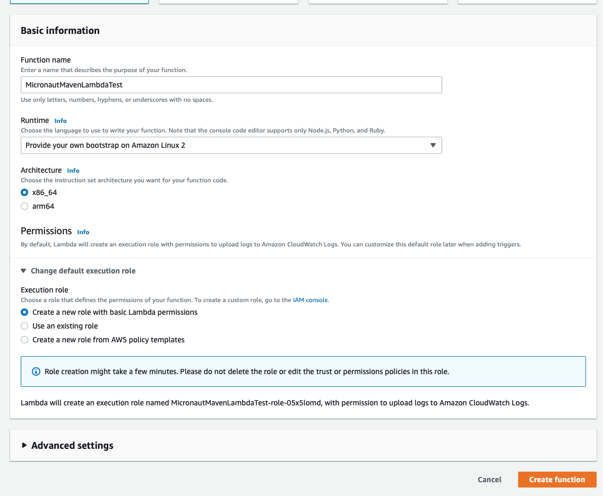
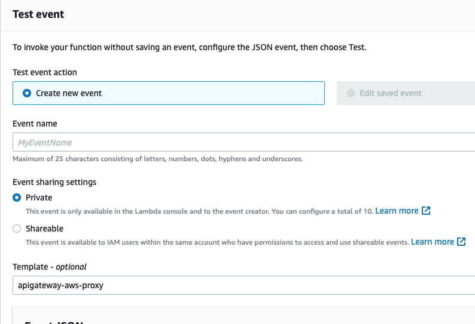
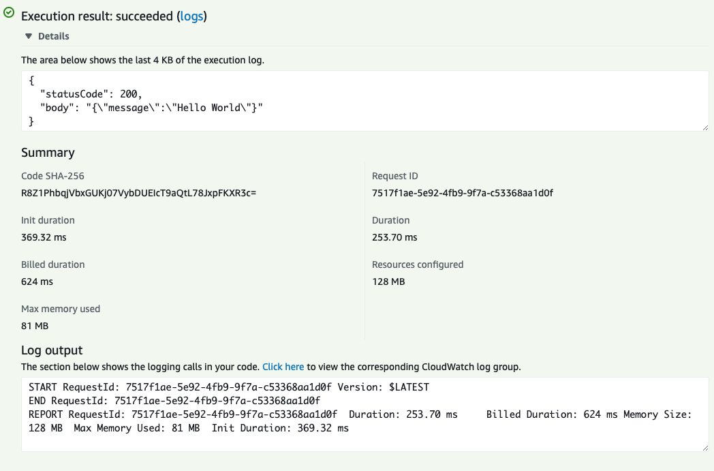

Steps to reproduce. 

Create a Lambda function with Provided Runtime



Expected result: 

Testing the function with an API Gateway event:





# Scenario 1 - Micronaut 3.4.4

- Go to 344 folder

- Run `./mvnw package -Dpackaging=docker-native -Dmicronaut.runtime=lambda -Pgraalvm`

- Upload `target/function.zip` to function code. 

- Execute function. It works. 

# Scenario 2 - Micronaut 3.5.0-SNAPSHOT

- Go to 350 folder

- Run `./mvnw package -Dpackaging=docker-native -Dmicronaut.runtime=lambda -Pgraalvm`

- Upload `target/function.zip` to function code. 

- Execute function. It works. 

# Scenario 3 - Micronaut 3.5.0 Multi Module

- Go to `multimodule` folder

- Run `./mvnw package -Dpackaging=docker-native -Dmicronaut.runtime=lambda -Pgraalvm`

- Upload `app/target/function.zip` to function code. 

- Execute function. It fails with: 

```
START RequestId: 2b5866bb-b3e6-4294-b48b-4132c303ac74 Version: $LATEST
Invocation with requestId [2b5866bb-b3e6-4294-b48b-4132c303ac74] failed: nulljava.lang.NullPointerException
at example.micronaut.FunctionRequestHandler.execute(FunctionRequestHandler.java:17)
at example.micronaut.FunctionRequestHandler.execute(FunctionRequestHandler.java:9)
at io.micronaut.function.aws.MicronautRequestHandler.handleRequest(MicronautRequestHandler.java:128)
at io.micronaut.function.aws.runtime.AbstractMicronautLambdaRuntime.startRuntimeApiEventLoop(AbstractMicronautLambdaRuntime.java:356)
at io.micronaut.function.aws.runtime.AbstractMicronautLambdaRuntime.run(AbstractMicronautLambdaRuntime.java:137)
at example.micronaut.FunctionLambdaRuntime.main(FunctionLambdaRuntime.java:12)
```
